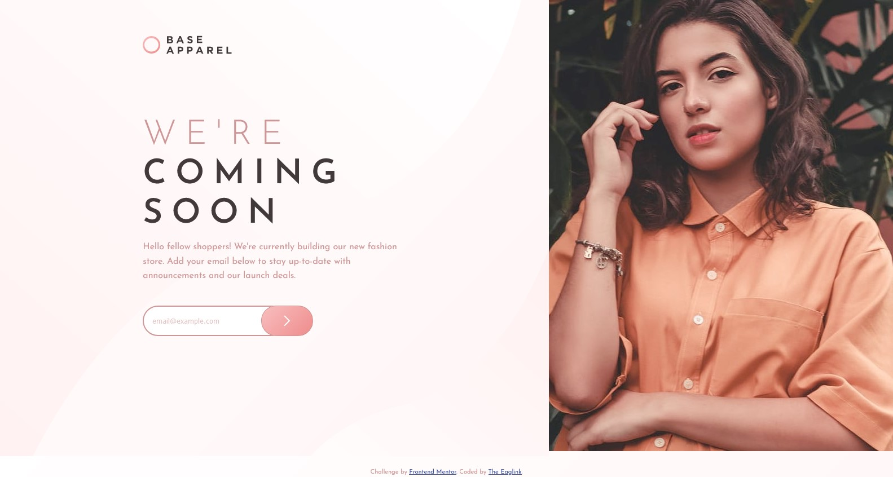

# Frontend Mentor - Base Apparel coming soon page solution

## Table of contents

- [Overview](#overview)
  - [The challenge](#the-challenge)
  - [Screenshot](#screenshot)
  - [Links](#links)
- [My process](#my-process)
  - [Built with](#built-with)
  - [Continued development](#continued-development)
  - [Useful resources](#useful-resources)
- [Author](#author)

## Overview

### The challenge

Users should be able to:

- View the optimal layout for the site depending on their device's screen size
- See hover states for all interactive elements on the page
- Receive an error message when the `form` is submitted if:
  - The `input` field is empty
  - The email address is not formatted correctly

### Screenshot

### Links

- Solution URL: (https://github.com/phyl/coming-soon-page/tree/main)
- Live Site URL: (https://phyl.github.io/coming-soon-page)

## My process

### Built with

- Semantic HTML5 markup
- CSS custom properties
- CSS Grid
- Mobile-first workflow
- JavaScript

### Continued development

I still need to continue practicing:

- CSS
- JavaScript

### Useful resources

- (https://stackoverflow.com/) 

## Author

- Website - Phyllis
- Frontend Mentor - [@phyl](https://www.frontendmentor.io/profile/phyl)
- Twitter - [@eaglink](https://www.twitter.com/eaglink)
